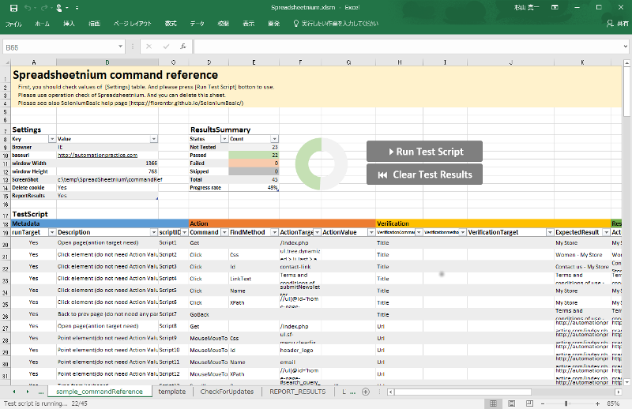

## Spreadsheetnium is Seleniumbasic front-end made by Excel vba.

You can use Selenium on Excel without any Java-IDE or unit test framework. I mean, even if you are not a web-programmer, you can use Selenium at a very low educational cost.

### Software dependent on this product

(translation)

- Windows 7 or later
- [Microsoft Excel 2010 or later](https://products.office.com/excel)
- [SeleniumBasic](https://florentbr.github.io/SeleniumBasic/)
- [chromedriver](https://sites.google.com/a/chromium.org/chromedriver/)

### Download

- [Release page](https://github.com/ssugiya/Spreadsheetnium/releases/latest)

## Documentation

- [How to setup Spreadsheetnium](./howToSetupSpreadsheetnium.md)
- [How to use Spreadsheetnium](./howToUseSpreadsheetnium.md)

