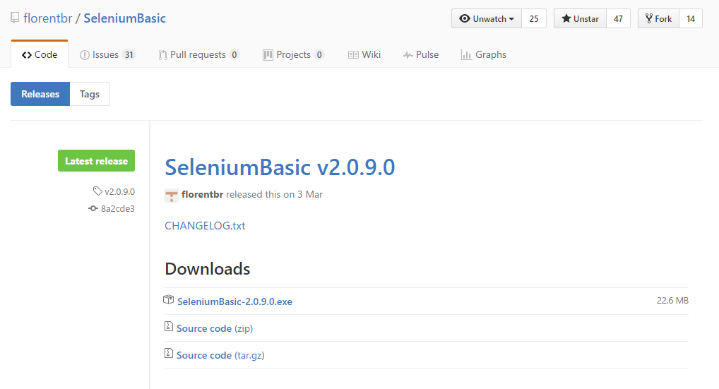
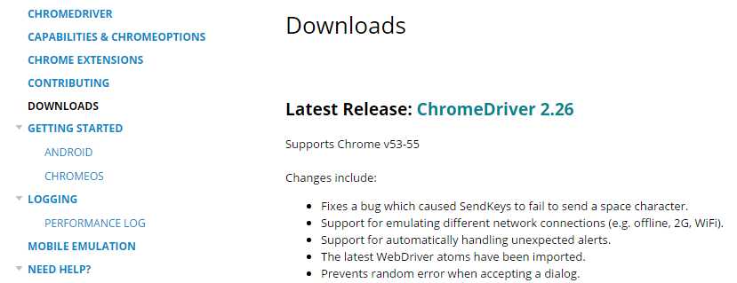
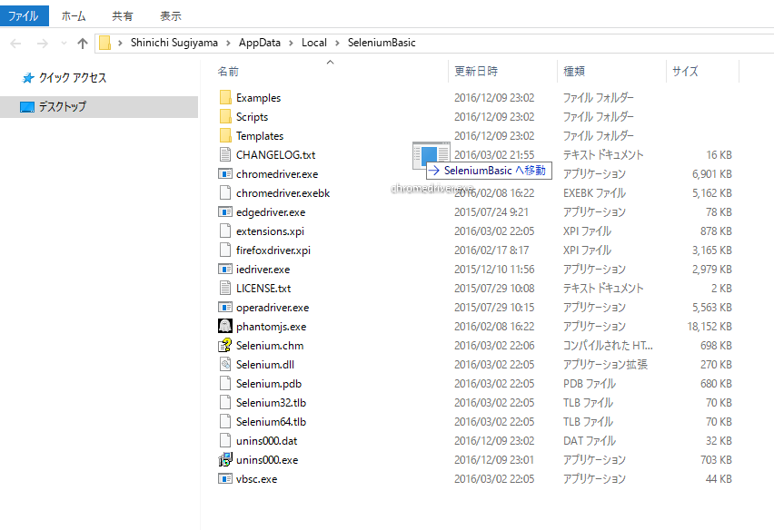
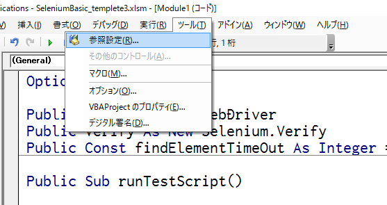

## How to setup Spreadsheetnium

### 1. Download and install SeleniumBasic
[https://github.com/florentbr/SeleniumBasic/releases/latest](https://github.com/florentbr/SeleniumBasic/releases/latest)

### 2. Update chrome driver (optional)

#### 2.1 Download driver
[https://sites.google.com/a/chromium.org/chromedriver/downloads](https://sites.google.com/a/chromium.org/chromedriver/downloads)

#### 2.2 Overwrite chromedriver.exe in the folder below.
%LOCALAPPDATA%\SeleniumBasic

### 3. Open VBA editor and activate Selenium library

#### 3.1 Press Alt+F11 on Excel and open reference settings

#### 3.2 Activate Selenium Type Library

### 4. Install Google Chrome extension (just recommend)

#### WebDriver Scripting Assistant
[https://chrome.google.com/webstore/detail/webdriver-scripting-assis/defeagjagbpfggackgppbadbafdfbjfo](https://chrome.google.com/webstore/detail/webdriver-scripting-assis/defeagjagbpfggackgppbadbafdfbjfo)

You can copy CSS SELECTOR to clipboard easily by right-click on the target element of HTML.

### 5. Download Spreadsheetnium

[https://github.com/ssugiya/Spreadsheetnium/releases](https://github.com/ssugiya/Spreadsheetnium/releases)

### 6. Read "how to use Spreadsheetnium"

[How to use Spreadsheetnium](./howToUseSpreadsheetnium.md)

