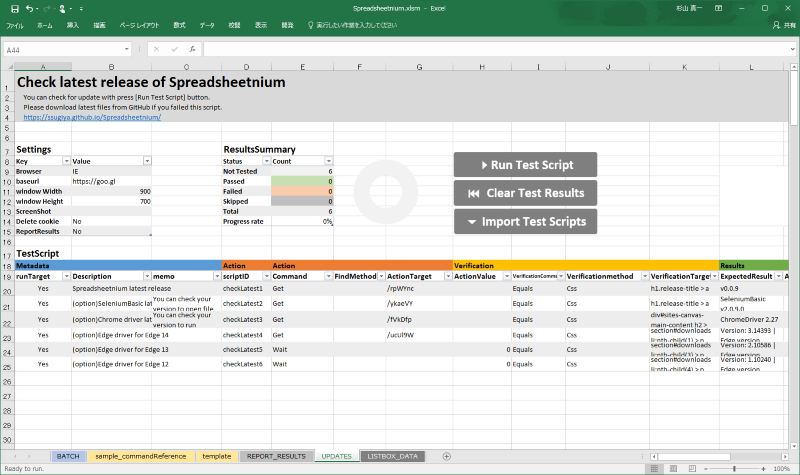

## How to use Spreadsheetnium

### Setup Spreadsheetnium
Please download and setup Spreadsheetnium if you did not download Spreadsheetnium.xlsm yet. See below.

[How to setup Spreadsheetnium](./howToSetupSpreadsheetnium.html)

### Try using Spreadsheetnium for test

- Please refer [this page (English)](http://stackoverflow.com/questions/25686108/fiddler-gateway-proxy-username-password) or  [this page (Japanese)](http://qiita.com/Nuits/items/1bd84b45b0b092527d8d) if you have to input proxy user/password on pop up window.
- Open [sample_commandReference]sheet.
- Press [Run Script] button.
- You will see how Spreadsheetnium run then web browser was opening and   test results are counting automatically.

- You can delete this sheet after you had checked how works this.

### How to create new test script

- Open [template] sheet.
- Right-click on sheet name tab and select [move or copy sheet].
- You can change test title and description area in copied new sheet.
- You should write test scripts in [TestScript] area. Test scope of the test script depends on the Excel table.
- The tests are executed in order from the top of the table.
- Each line is composed of "Meta data of test scripts", "Actions", "Verification Content", "Verification Result", and labels of blue, orange, yellow and green are displayed in the header.
- "Validation result" is entered automatically so you don't have to enter this.
- Please refer to [Write test script] below for detailed description method of test script.

#### Settings

- Browser
	- Select the WEB Browser to use
	- Because of Webdriver's limitation, Firefox will only work with 46.0.1. Please turn off the automatic update setting
    - PhantomJS is Headless browser so there is no screen display.
- Baseurl
	- Input the domain name to be tested.
- Window width, Window height
	- Set vertical / horizontal pixels of Browser
- Screenshot
	- Specify the directory to save the screen picture under test.
    - If blank this field, photos are not taken
    - The photo file name is saved as [scriptID]_[HTML Title]_[Description]_[Result].png
- Delete cookie
	- Set [Yes] to delete cookies at the start of the Testing.
- Report Results
	- Set it to [ON] if you want to report the test results to slack, redmine, etc. The report processing is same from spreadsheetnium's normal test script creation method (!), So it has flexibility. Please write the script of the test result report on the "REPORT_RESULTS" sheet.

#### Write test script

##### Metadata
- run target
    - If this column is set to [No], it is excluded from the test execution. In that case the test result will be "Skipped"。
- Description
    - Describe the purpose and description of the test. This field is used as part of the filename of the screenshot.
- scriptID
    - Describe any testing-ID you like.　This field is used as part of the filename of the screenshot.

#####  Action
- command
    - Describe what you want to operate with WEB browser. You can select the command of Selenium Webdriver.
- Findmethod
    - Decide how you want to select the object you want to manipulate. We recommend choosing CSS.
- actiontarget
    - It is useful to use the google chrome plugin [WebDriver Scripting Assistant](https://chrome.google.com/webstore/detail/webdriver-scripting-assis/defeagjagbpfggackgppbadbafdfbjfo) or [Copy Css Selector](https://chrome.google.com/webstore/detail/copy-css-selector/kemkenbgbgodoglfkkejbdcpojnodnkg) as an auxiliary input. You can copy CSS SELECTOR to clipboard easily by right-click on the target element of HTML.
- actionvalue
	- Input is required when specifying values with Sendkeys, Selectbox, etc. For details, please refer to [sample_commandReference].

#####  verification

- command
- method
- target
- expected result

### Run test script

- Results
	- ActualResult
    - Result
    - LastUpdate
    - ErrorMessage
    - Memo

### Clear Test Results

----

### Run batch testing

#### Initialize test target

#### Run batch process

### Check for updates

### Inport test scripts

