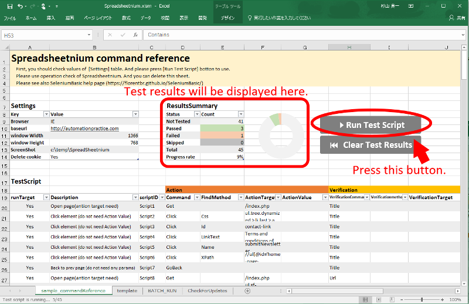
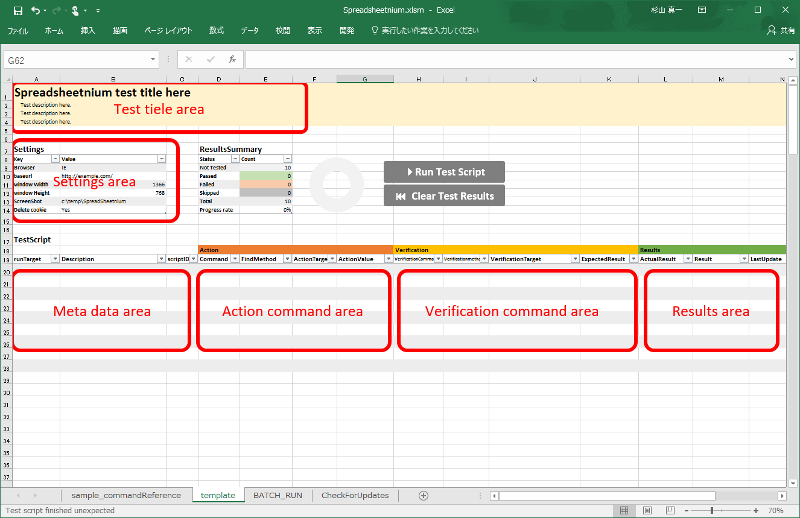
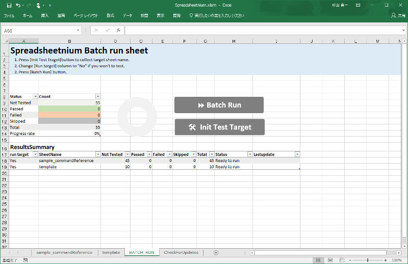

## How to use Spreadsheetnium

### Setup Spreadsheetnium
Please download and setup Spreadsheetnium if you did not download Spreadsheetnium.xlsm yet. See below.

[How to setup Spreadsheetnium](./howToSetupSpreadsheetnium.html)

### Try using Spreadsheetnium for test

- Please refer [this page](http://stackoverflow.com/questions/25686108/fiddler-gateway-proxy-username-password) if you have to input proxy user/password.
- Open [sample_commandReference]sheet.
- Press [Run Script] button.
- You will see how Spreadsheetnium run then web browser was opening and   test results are counting automatically.

- You can delete this sheet after you had checked how works this.

(transration)

- proxy user/passwordを入力する環境で動作させる場合は、[こちら](http://qiita.com/Nuits/items/1bd84b45b0b092527d8d)を参考にしてください
- [sample-commandReference]sheetを選択してください
- [Run Test Script]を押してください
- WEB Browserが起動し、試験結果が自動更新されることで、Spreadsheetniumの動作が確認できます。
- 動作確認後、このSheetは削除可能です

### How to create new test script

- - Open [template] sheet.
- Right-click sheet name and select [move or copy sheet].
- 

#### Settings

- Browser
 - aslfalsiefjlfaisfjale
 - skdjfaea
 - ksajfaife
- Baseurl
 - alksfjaeja
- Window width、height
- Screenshot
- Delete cooie

- you can insert rows and columns anyware. you do not have to 

#### Write test script

- run target
- Description
- scriptID
- command, Findmethod, actiontarget, actionvalue
- verification
- - command
- - method, target, expected results

### Run test script

### Clear Test Results

----

### Batch run test script

#### Initialize test target

#### batch Run

### Check for updates

